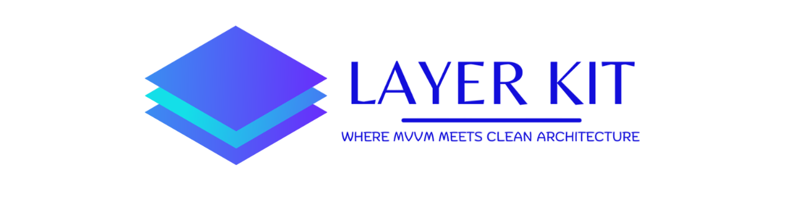

# LayerKit

> Where MVVM meets Clean Architecture

LayerKit is a powerful Flutter framework that combines the best aspects of MVVM (Model-View-ViewModel) pattern with Clean Architecture principles to create a robust, maintainable, and scalable application structure.


[](https://pub.dev/packages/layer_kit)
[](https://opensource.org/licenses/MIT)



## 🌟 Features

- **Clean Project Structure** - Organized folder structure that follows both MVVM and Clean Architecture principles
- **Feature Generation** - CLI tools to quickly scaffold new features with all necessary components
- **Project Generation** - Quickly bootstrap an entire project with best practices built-in
- **Error Handling** - Standardized exceptions and failures for consistent error handling
- **Configuration System** - Flexible configuration for different environments
- **Extension Methods** - Utility extensions for common types to reduce boilerplate
- **UI Utilities** - Helper methods for common UI tasks like decorations
- **Logging** - Development-friendly logging system

## 📋 Table of Contents

- [Installation](#installation)
- [Project Structure](#project-structure)
- [Getting Started](#getting-started)
    - [Generating a New Project](#generating-a-new-project)
    - [Generating a New Feature](#generating-a-new-feature)
- [Core Concepts](#core-concepts)
    - [MVVM + Clean Architecture](#mvvm--clean-architecture)
    - [ViewModels](#viewmodels)
    - [Use Cases](#use-cases)
    - [Repositories](#repositories)
- [Configuration](#configuration)
- [Extensions](#extensions)
- [Contributing](#contributing)
- [License](#license)

## 🚀 Installation

Add LayerKit to your pubspec.yaml:

```yaml
dependencies:
  layer_kit:
```

Run:

```bash
flutter pub get
```

## 🏁 Getting Started

### Generating a New Project

Create a new Flutter project, then run:

```bash
dart run layer_kit --project
```

This will generate a properly structured project with all the necessary files and configurations.

### Generating a New Feature

To add a new feature to your project:

```bash
dart run layer_kit --feature feature_name
```

This command will:
1. Create a feature directory in the `src` folder
2. Generate all necessary files following MVVM and Clean Architecture principles
3. Update routes to include the new feature

## 📁 Project Structure

LayerKit organizes your project into a well-defined structure:

```
lib/
├── config/                         # Configuration files
│   ├── data/                       # Data-related config
│   ├── lang/                       # Localization
│   ├── routes/                     # Routing
│   └── theme/                      # Theme configuration
├── core/                           # Core components
│   ├── callbacks/                  # Callback interfaces
│   ├── common/                     # Common utilities
│   │   └── widgets/                # Reusable widgets
│   ├── constants/                  # Constants
│   ├── extensions/                 # Extension methods
│   ├── helper/                     # Helper methods 
│   ├── network/                    # Network service 
│   └── utils/                      # Utilities
├── src/                            # Features
│   ├── feature1/                   # Feature module
│   │   ├── datasource/             # Data sources
│   │   │   ├── models/             # Data models
│   │   │   │   ├── body_models/    # UI display Model (used in screens)
│   │   │   │   ├── requests/       # API request models
│   │   │   │   └── response/       # API response models
│   │   │   └── repo/               # Repository implementation
│   │   ├── providers/              # Feature providers
│   │   └── screens/                # UI screens
│   └── feature2/                   # Another feature module
├── di_container.dart               # Dependency Injection imports (part of di main)
├── di_container.main.dart          # di main file - injection of all dependencies
└── main.dart                       # Entry point
```

## ⚙️ Configuration

LayerKit provides a flexible configuration system through `KitConfig`:

```dart
/// ...code....  
@override
Widget build(BuildContext context) {
  SystemChrome.setPreferredOrientations([
    DeviceOrientation.portraitUp,
    DeviceOrientation.portraitDown,
    // DeviceOrientation.landscapeRight,
    // DeviceOrientation.landscapeLeft,
  ]);

  return Consumer<ThemeProvider>(builder: (context, state, _) {
    return LayerKitConfigProvider(
      envType: EnvType.development,
      defaultRadius: 10,
      showApiReqLog: false,
      showApiResLog: true,
      /// other config options
      child: AppResponsiveTheme( /// for Theme Configuaration [see responsive_theme package on pub.dev]
        themeMode: state.theme,
        config: ColorConfig(
          lightColors: AppColors.light().toThemeColor(),
          darkColors: AppColors.dark().toThemeColor(),
        ),
        child: ToastificationWrapper(
          child: MaterialApp(
            title: AppConsts.appName,
            debugShowCheckedModeBanner: false,
            /// route config [see flutter_easy_routing package on pub.dev]
            navigatorKey: AppRouter.navigatorKey,
            onGenerateRoute: (s) => AppRouter.generateRoute(s, SplashScreen()),
            scrollBehavior: const StretchScrollBehavior(),
            initialRoute: Routes.splash.path,
            localizationsDelegates: context.localizationDelegates,
            supportedLocales: context.supportedLocales,
            locale: context.locale,
            theme: state.darkTheme ? ThemeData.dark() : ThemeData.light(),
            builder: (context, child) {
              return MediaQuery(
                data: MediaQuery.of(context).copyWith(textScaler: const TextScaler.linear(1.0)),
                child: child ?? SizedBox(),
              );
            },
          ),
        ),
      ),
    );
  });
}
/// ...code....
```

## 🧠 Core Concepts

### MVVM + Clean Architecture

LayerKit combines MVVM pattern with Clean Architecture principles:

- **View** - Flutter UI components (screens, widgets)
- **ViewModel** - Business logic and state management
- **Model** - Data models and repository interfaces

With additional Clean Architecture layers:
- **Repositories** - Abstract data source interactions and Implementation that access data models
- **Data Sources** - Concrete implementations of data access - Models, Requests, Responses

### ViewModels

ViewModels in LayerKit extend the `BaseViewModel` class:

```dart
class MovieProvider extends BaseViewModel {
  final MovieRepo _movieRepo;
  final NetworkService _networkService;

  MovieProvider({required MovieRepo movieRepo, required NetworkService networkService})
          : _movieRepo = movieRepo,
            _networkService = networkService;

  Future<bool> getData({
    required String data1,
    required String data2,
    bool listen = true,
  }) async {
    setLoading();
    final isNetwork = await _networkService.isConnected;
    final isSuccess = await apiCallback(
      name: "getData",
      isNetwork: isNetwork,
      doWhenOnline: () async {
        final req = MovieReq(data1: data1, data2: data2);
        final res = await _movieRepo.getData(req);
        showSnackbar(res.message);
        setLoaded();
        return res.status;
      },
      errorListener: (e) {
        setError(e.toString());
      },
    );
    if (listen) notifyListeners();
    return isSuccess;
  }
}
```

### Repositories

Repositories abstract data sources:

```dart
abstract interface class MovieRepo {
  Future<MovieResponse> getData(MovieReq req);
}

class MovieRepoImpl implements MovieRepo {
  final DioClient _dioClient;

  MovieRepoImpl({required DioClient dioClient}) : _dioClient = dioClient;

  @override
  Future<MovieResponse> getData(MovieReq req) async {
    return await repoCallback<MovieResponse>(
      name: "getData",
      callback: () async {
        final res = await _dioClient.post(Apis.getData, data: req.toJson());
        return MovieResponse.fromJson(res.data ?? {});
      },
    );
  }
}
```


## 🛠️ Extensions

LayerKit includes several useful extensions:

```dart
// String casing
"hello world".toTitleCase      // "Hello World"
"example".firstUpperCased      // "Example"

// Time formatting
120.toMMSS                     // "02 : 00"
3725.toHHMMSS                  // "01 : 02 : 05"
```

## 🤝 Contributing

Contributions are welcome! Please feel free to submit a Pull Request.

## 📄 License

LayerKit is available under the MIT license. See the [LICENSE](LICENSE) file for more info.

---

Created by [Nayan Parmar](https://github.com/Parmar24c) © 2025